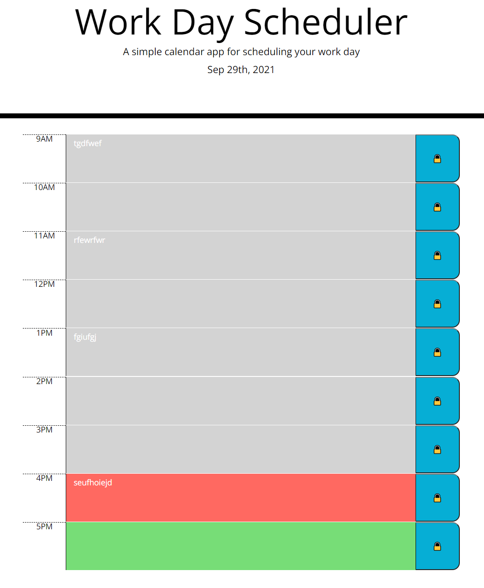

# 05 Third-Party APIs: Work Day Scheduler

## Work Description
 
<pre>
  This scheduler was created with the user story and acceptance criteria in mind. As the user goes through
their day they can type important events into the hour long slots and save them with a click of the 'lock'
button to the right of the text box. If they were to refresh the page this save feature ensures that their 
text will reappear in the original box. The colors of the textbox changes as the day progresses. If the 
textbox is grey that means the time has passed, red for the present hour and green for the future hours. 
This should help identify what they should be doing at that moment based on the items in their calendar.

The current date is also listed at the top of the screen so they know what day is it. Future developments 
of the scheduler may include a time presentation below the date and arrow keys to the left and right of the
schedule that would allow them to progress to the next day or regress to the prior day so that they could
plan or review their activities on other days. 

</pre>

## User Story

```md
AS AN employee with a busy schedule
I WANT to add important events to a daily planner
SO THAT I can manage my time effectively
```

## Acceptance Criteria

```md
GIVEN I am using a daily planner to create a schedule
WHEN I open the planner
THEN the current day is displayed at the top of the calendar
WHEN I scroll down
THEN I am presented with timeblocks for standard business hours
WHEN I view the timeblocks for that day
THEN each timeblock is color coded to indicate whether it is in the past, present, or future
WHEN I click into a timeblock
THEN I can enter an event
WHEN I click the save button for that timeblock
THEN the text for that event is saved in local storage
WHEN I refresh the page
THEN the saved events persist
```

## ScreenShot of Program



Link to the Deployed Site: https://polsen-92.github.io/Work_Day_Scheduler/
